# 🧠 Rapport d'Expérimentation : Phase 1 - Neurone Artificiel

> [!NOTE]
> **Objectif :** Implémentation "from scratch" des fondations d'un Perceptron Multi-Couche (PMC), incluant la passe avant (forward pass) et le calcul de l'erreur via la Binary Cross-Entropy (BCE).

---

## 🏗️ Architecture du Modèle
Le modèle testé dans cette phase est un neurone unique (ou couche dense de sortie) configuré pour une tâche de classification binaire.

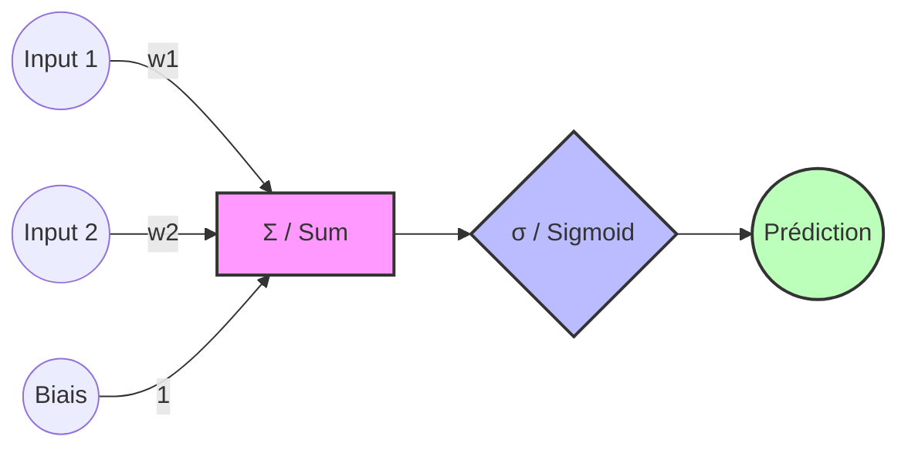

---

## 📊 Analyse des Scénarios d'Exécution

### 1. Scénario Normal
*Configuration : Poids optimisés manuellement ($w = [-1.5, 2.5]$, $b = -0.5$)*

| Échantillon | Prédiction | Label Attendu |
| :--- | :--- | :--- |
| n°1 | **0.366** | 0 |
| n°2 | **0.634** | 1 |
| n°3 | **0.690** | 1 |
| n°4 | **0.206** | 0 |

> [!TIP]
> **Performance :** La perte BCE est de **0.3781**, indiquant que le modèle commence déjà à séparer les classes avec ces poids.

---

### 2. Cas Limite (Inputs à Zéro)
*Configuration : Entrées $X = [0, 0]$, mêmes poids que ci-dessus.*

| Métrique | Valeur |
| :--- | :--- |
| Prédictions | `[0.378, 0.378, 0.378, 0.378]` |

**Observation :** En l'absence de signal d'entrée, la sortie est uniquement pilotée par le biais. $\sigma(-0.5) \approx 0.378$.

---

### 3. Scénario Adversarial (Initialisation à Zéro)
*Configuration : Poids et biais initialisés à $0$.*

| Métrique | Valeur |
| :--- | :--- |
| Prédictions | `[0.5, 0.5, 0.5, 0.5]` |
| **Loss BCE** | **0.6931** |

> [!WARNING]
> **Entropie Maximale :** Une perte de **0.6931** corresponds exactement à $-\ln(0.5)$. Cela signifie que le modèle est dans un état d'incertitude totale (50/50), ce qui est le point de départ classique avant l'entraînement.

---

## 🛠️ Environnement Technique
- **NumPy Version :** `1.24.3`
- **Fonction d'Activation :** Sigmoïde
- **Loss :** Binary Cross-Entropy (BCE)

---


---

# 📉 Rapport d'Expérimentation : Phase 2 - Apprentissage par Descente de Gradient

> [!IMPORTANT]
> **Objectif :** Automatiser la recherche des poids optimaux en implémentant l'algorithme de descente de gradient et la rétropropagation de l'erreur.

---

## 🔄 Processus d'Apprentissage
Le modèle n'est plus statique. Il ajuste ses paramètres à chaque itération (epoch) pour minimiser la fonction de perte.

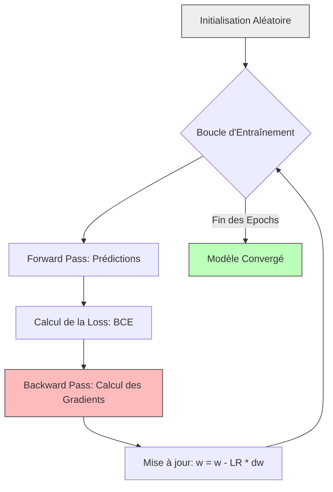

---

## 📈 Suivi de l'Entraînement
*Configuration : Learning Rate = 0.1 | Époques = 50*

| Époque | Loss (BCE) | Poids (w) | Biais (b) |
| :--- | :--- | :--- | :--- |
| 0 | **0.6934** | `[0.005, 0.015]` | `-0.000` |
| 10 | **0.6688** | `[-0.001, 0.170]` | `-0.010` |
| 20 | **0.6468** | `[-0.014, 0.316]` | `-0.032` |
| 30 | **0.6265** | `[-0.033, 0.453]` | `-0.063` |
| 40 | **0.6074** | `[-0.054, 0.585]` | `-0.098` |

---

## 🖼️ Courbe de Convergence

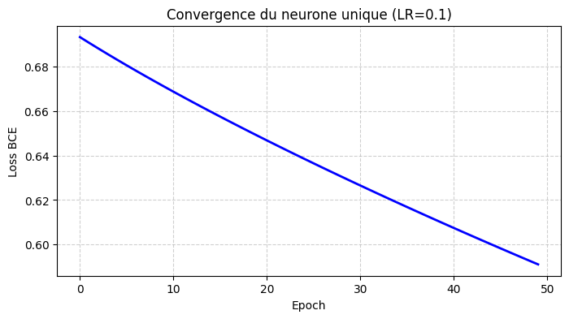

> [!TIP]
> **Analyse de la courbe :** On observe une diminution constante de la perte, ce qui confirme que le gradient calculé permet effectivement de descendre vers un minimum local. La pente s'adoucit au fil des itérations, signe que le modèle se rapproche de sa solution optimale pour ce taux d'apprentissage.

---

# 🌀 Rapport d'Expérimentation : Phase 3 - Le Problème du XOR

> [!IMPORTANT]
> **Objectif :** Résoudre le problème non-linéaire du XOR (eXclusive OR) en utilisant un Réseau de Neurones Multi-Couches (PMC). Cette phase démontre la nécessité d'au moins une couche cachée pour séparer des données non linéairement séparables.

---

## 🏗️ Architecture du Réseau (2-2-1)
Pour "plier" l'espace et isoler les classes du XOR, nous utilisons une couche cachée de 2 neurones.

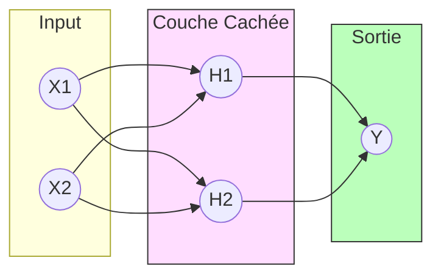

---

## 🔬 Analyse des Scénarios XOR

````carousel
### 🟢 Scénario 1 : Normal (Architecture 2-2-1)
*Le réseau réussit parfaitement à apprendre la logique XOR.*

| Époque | Loss | Accuracy |
| :--- | :--- | :--- |
| 0 | 0.6958 | 50.00% |
| 4000 | 0.0080 | 100.00% |
| 8000 | **0.0030** | **100.00%** |

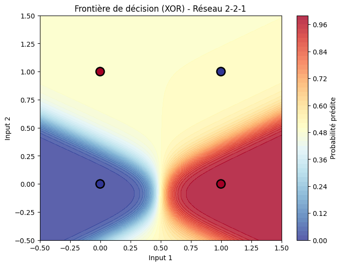

<!-- slide -->

### 🟡 Scénario 2 : Avec Bruit
*L'ajout de bruit teste la robustesse du modèle.*

| Époque | Loss | Accuracy |
| :--- | :--- | :--- |
| 0 | 0.6958 | 50.00% |
| 8000 | **0.0030** | **100.00%** |

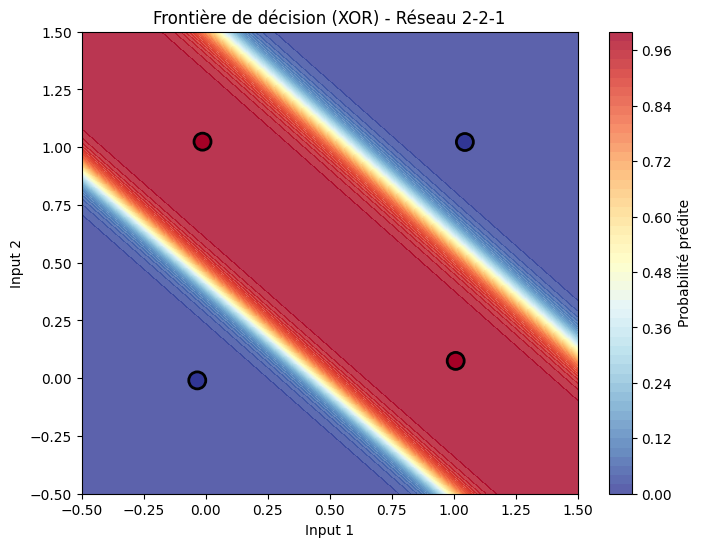

<!-- slide -->

### 🔴 Scénario 3 : Échec (1 Neurone Caché)
*Preuve théorique : 1 seul neurone ne peut pas résoudre le XOR.*

| Époque | Loss | Accuracy |
| :--- | :--- | :--- |
| 0 | 0.6967 | 50.00% |
| 8000 | **0.6931** | **50.00%** |

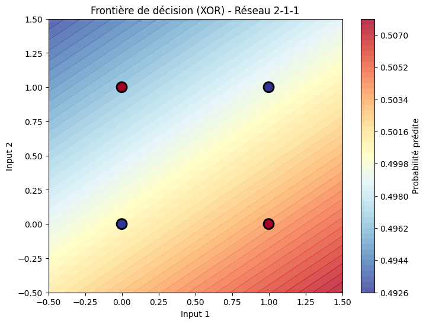

> [!CAUTION]
> **Pourquoi l'échec ?** Avec un seul neurone caché, le réseau ne peut créer qu'une seule droite de séparation. Le XOR nécessite deux droites pour isoler les points (0,1) et (1,0) des points (0,0) et (1,1).
````

---
---

# 🌀 Rapport d'Expérimentation : Phase 4 - Classification de Spirales Complexes

> [!IMPORTANT]
> **Objectif :** Relever un défi de classification non-linéaire complexe (spirales entrelacées). Cette phase introduit l'utilisation de **plusieurs couches cachées** et de la fonction d'activation **ReLU** pour capturer des motifs hautement non-linéaires.

---

## 🏗️ Architecture Profonde (2-64-64-1)
Le réseau utilise une structure pyramidale inversée pour extraire des caractéristiques de plus en plus abstraites.

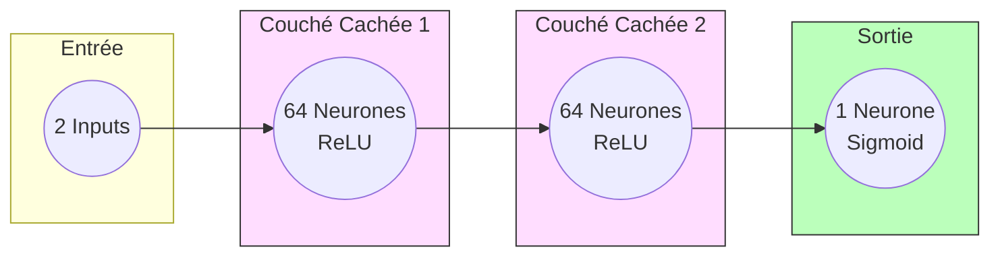

---

## 🔬 Étude Comparative des Scénarios

````carousel
### 🔵 Scénario 1 : "Deep Learning" (Configuration Optimale)
*Architecture 2-64-64-1 | Bruit 0.15*

| Époque | Loss | Accuracy |
| :--- | :--- | :--- |
| 0 | 0.7224 | 50.00% |
| 1000 | 0.2838 | 86.75% |
| 1999 | **0.0102** | **100.00%** |

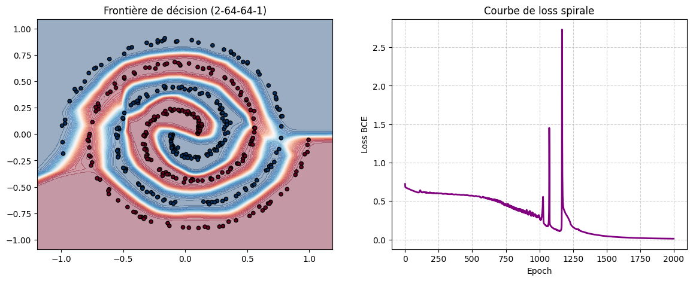

> [!TIP]
> **Succès :** Le réseau a parfaitement "appris" la topologie de la spirale, créant une frontière de décision fluide et précise.

<!-- slide -->

### 🟠 Scénario 2 : Underfitting (Manque de Capacité)
*Architecture 2-2-2-1 | Bruit 0.15*

| Époque | Loss | Accuracy |
| :--- | :--- | :--- |
| 0 | 0.7049 | 50.00% |
| 1999 | **0.6785** | **57.00%** |

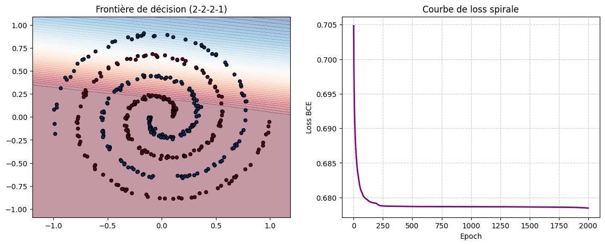

> [!WARNING]
> **Diagnostic :** Avec seulement 2 neurones par couche, le réseau est trop "simple" pour comprendre la spirale. Il se contente d'une séparation linéaire grossière.

<!-- slide -->

### 🔴 Scénario 3 : Données Adversarielles (Bruit Élevé)
*Architecture 2-64-64-1 | Bruit 0.50*

| Époque | Loss | Accuracy |
| :--- | :--- | :--- |
| 0 | 0.7223 | 50.00% |
| 1999 | **0.0544** | **98.50%** |

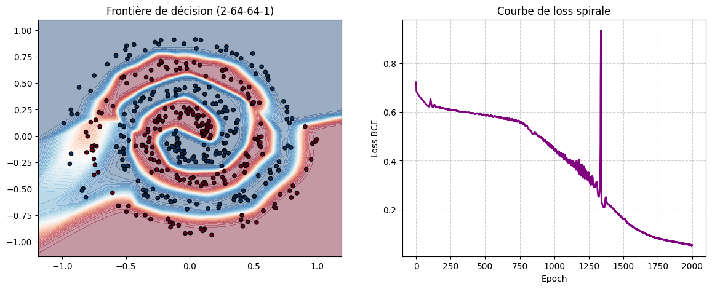

> [!NOTE]
> **Observation :** Malgré le chevauchement des points, le réseau profond parvient à extraire une tendance, bien que la frontière soit plus "tourmentée" pour s'adapter au bruit.
````

---
## ⚙️ Paramètres Techniques Avancés
- **Initialisation :** Méthode de **He** ($std = \sqrt{2/n}$) pour stabiliser l'apprentissage avec ReLU.
---

# 🔟 Rapport d'Expérimentation : Phase 5 - Transition vers Keras & MNIST

> [!IMPORTANT]
> **Objectif :** Industrialiser l'approche "from scratch" en utilisant le framework **Keras/TensorFlow**. Cette phase permet de comparer nos implémentations manuelles avec des outils optimisés pour des jeux de données réels comme **MNIST** (chiffres manuscrits).

---

## 🏗️ Architecture du Réseau (784-128-64-10)
Le passage à MNIST nécessite une entrée de 784 pixels (28x28) et une sortie multi-classe (10 chiffres).

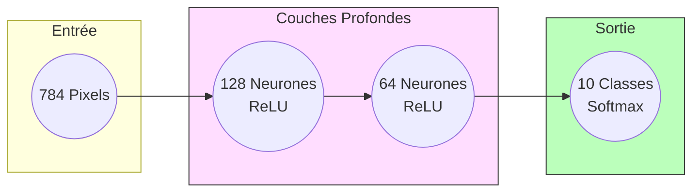

---

## ⚡ Performance et Scénarios d'Entraînement

````carousel
### 🟢 Scénario 1 : Standard (Optimisé)
*Batch Size: 64 | Optimiseur: Adam | Époques: 5*

| Métrique | Valeur |
| :--- | :--- |
| **Accuracy Test** | **97.72%** |
| Temps total | ~18s |
| Stabilité | Très haute |

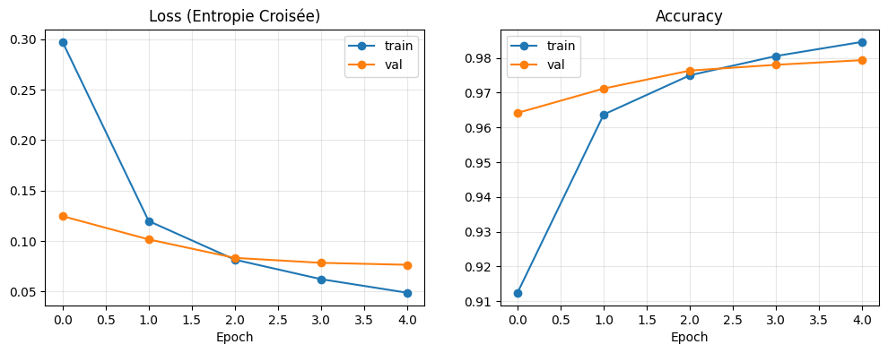

> [!TIP]
> **Efficacité :** L'utilisation de mini-batches (64) permet une convergence rapide et stable grâce à la parallélisation du CPU/GPU.

<!-- slide -->

### 🔴 Scénario 2 : Adversarial (Batch Size = 1)
*Mise à jour après chaque image unique (Stochastic Gradient Descent)*

| Métrique | Valeur |
| :--- | :--- |
| **Accuracy Test** | **96.65%** |
| Temps total | **596.1s (x30 plus lent)** |
| Bruit | Élevé sur la loss |

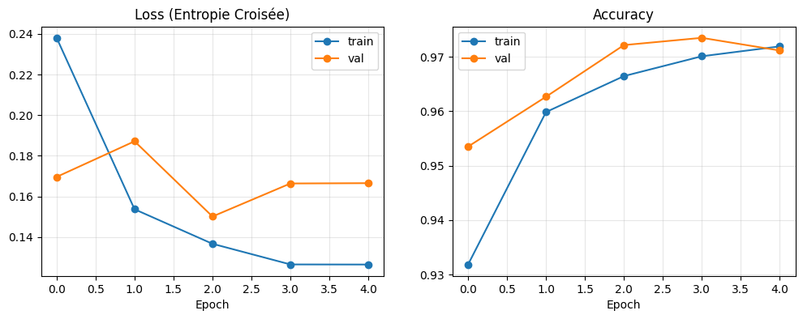

> [!CAUTION]
> **Inconvénient :** Un `batch_size=1` empêche toute optimisation vectorielle. Le temps de calcul explose et la descente de gradient devient très "erratique" (bruitée), rendant l'apprentissage inefficace sur de gros volumes.

<!-- slide -->

### ⚪ Scénario 3 : Cas Limite (Époques = 0)
*Évaluation d'un modèle non entraîné.*

| Métrique | Valeur |
| :--- | :--- |
| Accuracy Test | **~9.8%** |
| État | Aléatoire (1 chance sur 10) |

**Conclusion :** Sans phase d'apprentissage, le réseau ne peut que "deviner" au hasard parmi les 10 classes possibles.
````

---

## 🧪 Concepts de Deep Learning Appliqués
- **Optimiseur ADAM :** Combine les avantages d'AdaGrad et RMSProp pour adapter le taux d'apprentissage de chaque paramètre.
- **Softmax :** Transforme les scores de sortie en probabilités (la somme est égale à 1.0).
- **Sparse Categorical Cross-Entropy :** Fonction de perte idéale pour la classification multi-classe sans encodage one-hot.

---
*Généré par Antigravity - Expert IA*