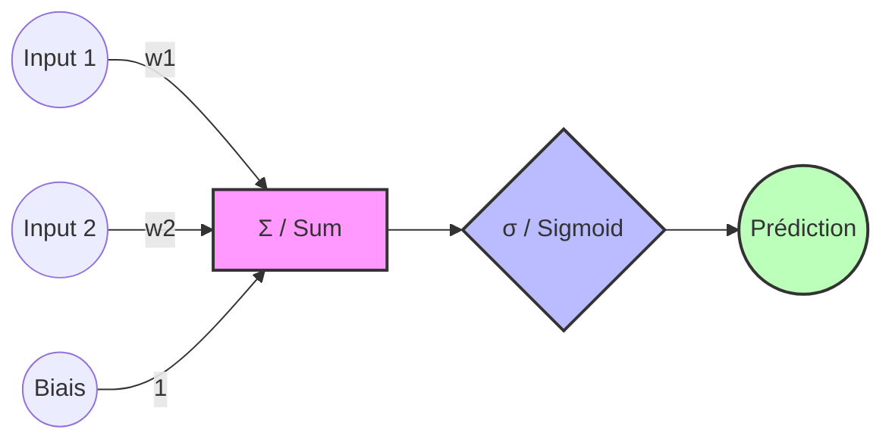
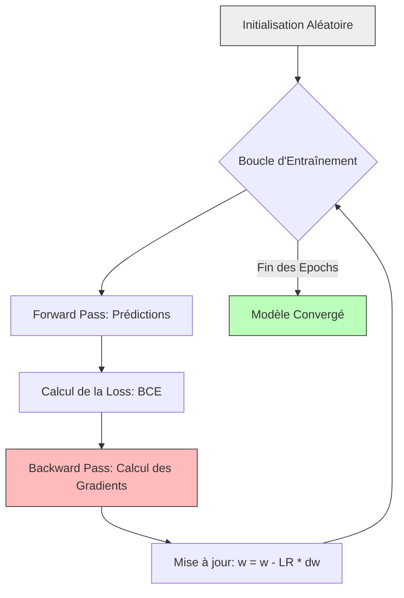

# 🧠 Rapport d'Expérimentation : Phase 1 - Neurone Artificiel

> [!NOTE]
> **Objectif :** Implémentation "from scratch" des fondations d'un Perceptron Multi-Couche (PMC), incluant la passe avant (forward pass) et le calcul de l'erreur via la Binary Cross-Entropy (BCE).

---

## 🏗️ Architecture du Modèle
Le modèle testé dans cette phase est un neurone unique (ou couche dense de sortie) configuré pour une tâche de classification binaire.

---

## 📊 Analyse des Scénarios d'Exécution

### 1. Scénario Normal
*Configuration : Poids optimisés manuellement ($w = [-1.5, 2.5]$, $b = -0.5$)*

| Échantillon | Prédiction | Label Attendu |
| :--- | :--- | :--- |
| n°1 | **0.366** | 0 |
| n°2 | **0.634** | 1 |
| n°3 | **0.690** | 1 |
| n°4 | **0.206** | 0 |

> [!TIP]
> **Performance :** La perte BCE est de **0.3781**, indiquant que le modèle commence déjà à séparer les classes avec ces poids.

---

### 2. Cas Limite (Inputs à Zéro)
*Configuration : Entrées $X = [0, 0]$, mêmes poids que ci-dessus.*

| Métrique | Valeur |
| :--- | :--- |
| Prédictions | `[0.378, 0.378, 0.378, 0.378]` |

**Observation :** En l'absence de signal d'entrée, la sortie est uniquement pilotée par le biais. $\sigma(-0.5) \approx 0.378$.

---

### 3. Scénario Adversarial (Initialisation à Zéro)
*Configuration : Poids et biais initialisés à $0$.*

| Métrique | Valeur |
| :--- | :--- |
| Prédictions | `[0.5, 0.5, 0.5, 0.5]` |
| **Loss BCE** | **0.6931** |

> [!WARNING]
> **Entropie Maximale :** Une perte de **0.6931** corresponds exactement à $-\ln(0.5)$. Cela signifie que le modèle est dans un état d'incertitude totale (50/50), ce qui est le point de départ classique avant l'entraînement.

---

## 🛠️ Environnement Technique
- **NumPy Version :** `1.24.3`
- **Fonction d'Activation :** Sigmoïde
- **Loss :** Binary Cross-Entropy (BCE)

---

---

# 📉 Rapport d'Expérimentation : Phase 2 - Apprentissage par Descente de Gradient

> [!IMPORTANT]
> **Objectif :** Automatiser la recherche des poids optimaux en implémentant l'algorithme de descente de gradient et la rétropropagation de l'erreur.

---

## 🔄 Processus d'Apprentissage
Le modèle n'est plus statique. Il ajuste ses paramètres à chaque itération (epoch) pour minimiser la fonction de perte.

---

## 📈 Suivi de l'Entraînement
*Configuration : Learning Rate = 0.1 | Époques = 50*

| Époque | Loss (BCE) | Poids (w) | Biais (b) |
| :--- | :--- | :--- | :--- |
| 0 | **0.6934** | `[0.005, 0.015]` | `-0.000` |
| 10 | **0.6688** | `[-0.001, 0.170]` | `-0.010` |
| 20 | **0.6468** | `[-0.014, 0.316]` | `-0.032` |
| 30 | **0.6265** | `[-0.033, 0.453]` | `-0.063` |
| 40 | **0.6074** | `[-0.054, 0.585]` | `-0.098` |

---

## 🖼️ Courbe de Convergence

> [!TIP]
> **Analyse de la courbe :** On observe une diminution constante de la perte, ce qui confirme que le gradient calculé permet effectivement de descendre vers un minimum local. La pente s'adoucit au fil des itérations, signe que le modèle se rapproche de sa solution optimale pour ce taux d'apprentissage.

---
